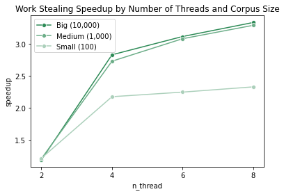
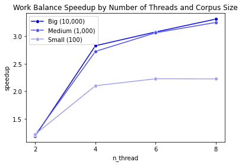

# MPCS 52060 - Parallel Programming: Project 3 Report
## Paralellizing Co-occurrence matrices for Natural Language Processing  
**Author:** Zander Meitus  
**Due Date:** May 23, 2023  

## Contents
 - Overview  
    - Definitions  
    - Challengs & Hot spots  
 - Data setup
    - Synopsis data  
    - Vocabulary  
 - Implementation  
    - Sequential  
    - Work Stealing  
    - Work Balancing
- Experiments & Analysis
    - Machine Specifications  
    - Results  
- Interface Note  
- Thank you!  

## Overview
### Definitions  
Co-occurrence matrices are a fundamental technique for analyzing text and are a key component of 
some word-vector embeddings approaches such as (LSA) and Global Vector Embeddings (GloVe). To understand the concept of a co-occurence matrix, it is important to first define some terms:  
    - corpus: a complete collection of text to be analyzed  
        - e.g., a set of movie synopses.  
    - document: a discrete unit of text within the corpus  
        - e.g., an individual movie synopsis.  
    - context: for a given word in a given document, the context  
        - e.g., in a movie synopsis, the context may be the sentence a word appears in, or a sliding window of the previous $k$ words in the synopsis for the $i^{th}$ word.  
    - vocabularly: a set of words of interest to be considered in the co-occurrence matrix  

Let $V$ be the vocabularly of interest. The co-occurrence matrix $C$ will be of size $n x n$, where, $|V| = n$. The value in row $i$ and column $j$ of $V$ ($V_{ij}$) is how many times word $v_j$ appears in the context of word $v_i$ across the documents in the corpus.

For example, take a corpus of the sentences below, where each of the sentences is a document and the context for a given word incudes the prior 2 words ($k=2$) in a document.

"I like dogs."
"Dogs like food." 
"Do cats like dogs?"

For this example, the vocabularly $V$ is defined as all unique words in the corpus:
$$V = \{I, like, dogs, food, do, cats\}$$
$$|V| = 6$$

The co-occurrence matrix $C$ for this corpus and context size is:

|         | I| like| dogs |food| do| cats|
|---------|--|-----|------|----|---|-----|
| **I**   | 0| 0   | 0    |0   | 0 | 0   |
| **like**| 1| 0   | 1    | 0  | 1 | 1   |
|**dogs** |1 | 2   | 0    | 0  | 0 | 1   |
|**food** |0 | 1   | 1    |0   | 0 | 0   |
|**do**   |0 | 0   | 0    | 0  | 0 | 0   |
|**cats** |0 | 0   | 0    | 0  | 1 | 0   |

The entry $C_{3,2}$ is 2 because the word "like" appears in the context of the word dog twice: once in the first document (sentence) and once in the last document. Notice for a sliding context window, the matrix is not symmetric. For example, $C_{43} = 1  \neq C_{34} =0$. 

### Challenges & Hot spots  
Beyond the fundamental utility of co-occurence matrices in many areas of natural language processing, one main challenge for implementing a parallel system is the large memory footprint. Assuming 8 bytes per cell and a vocabulary of 170,000 words (the <a href='https://englishlive.ef.com/blog/language-lab/many-words-english-language/'>approximate number</a> of words in the Oxford English Dictionary that are in current use), the co-occurence matrix would be over 230GB. If we wish to parallelize this calculation, that is a lot of data to replicate or synchornize accross. 

There are 3 main hot spots in the construction of co-occurrence matrices:
1) Processing each document into a format where word co-occurences can be tabulated.  
2) The calclation of the co-occurrences within a given document.  
3) Aggregating co-occurrences across documents.  

2) and 3) seem to lend themselves to a map-reduce pattern and I was interested to practice this pattern more. 

## Data setup  
### Synopsis data
Data comes from the <a href='https://ritual.uh.edu/mpst-2018/'>Movie Plot Synopsis with Tags (MPST)</a> dataset and accessed via <a href='https://www.kaggle.com/datasets/cryptexcode/mpst-movie-plot-synopses-with-tags'>Kaggle</a> (dataset posted by one of original authors). The dataset contain synopses for over 14,000 movies from either wikipedia or imdb. I then process the data into three samples of of 100, 1,000, and 10,000 movies using the script `proj3/util/create_data_files.py`. The files can be recreated using the following command from the `util` directory:  
`    >python create_data_files.py 100 1000 10000`
The script outputs json files for each sample size, with a single sample of the form  
`{"Id": <movie id string>, "Title": <movie title string>, "Text":<movie synopsis string>}`

### Vocabulary 
Co-occurrence matrices are often limited to a subset vocabularly that is not the full vocabularly observed in the corpus nor the full vocabularly of a given language. In this setting, I will limit the vocabularly to a subset of the $p$ most frequent words in the corpus. Here, $p=5000$. I generate the vocabulary of interest in `proj3/util/get_vocab.py`. The files can be recreated using the following command from the `util` directory:  
`    >python get_vocab.py 5000`

## Implementation
### Sequential
The sequential version first initializes a co-occurrence matrix struct (specified in the `cooc` package) and loads the vocabulary. It then reads in the specified json file, decodes the json to a `Document` struct and appends enqueues the document to the global queue. The program then main thread then iterates over the global queue, dequeing a document and calculating the context counts for each pair of word-context word in that document. Only when both the word and context word appear in the vocabulary discussed above is the pair counted.  

"Tokenization" is an important step where a string is converted to a slice of tokens, enabling the counting of context token pairs. There are many types of tokenization. This implementation uses a basic form of converting all characters to lower case and splitting strings by spaces. 

### Work Stealing  
THe work stealing implementation starts in a similar fashion by sequentially decoding the document jsons to `Documents`. However, instead of a normal queue, the work stealing method implements a channel. An array of double-ended queue (DEQ) arrays is then created, where there are $w-1$ DEQ arrays. $w$ is the number of available workers.  The documents are then distributed among the $w-1$ workers to perform the co-occurrence mapping and place the result in another channel. Once a a worker exhausts its queue, it sets a `CriminalFlag` and begins stealing from other workers' queues that are not empty. Once all workers have exhausted their queues at least once, the workers stop processing.

 The one remaining worker iterates over the results channel as the other workers are adding to it and reduces them into the final co-occurrence matrix, completing the Map-Reduce pattern.  

### Work Balancing
The work balancing algorithm functions as the work stealing algorithm with the exception of how each worker iterates over its local queue. After every 5th document a workers processes from its local queue, it will flip a biased coin with probability $\frac{1}{|Q|}$, where $|Q|$ is the number of documents remaining in the local queue. If the flip returns `true`, the worker will select a victim that still has work remaining and compare the lengths of their queues. If the absolute difference is equal to or greater than the `thresholdBalance`, then the worker with less work will steal the number of documents equal to half the difference (rounded down). For this analysis, the `thresholdBalance` was set to 5

## Experiments & Analysis
### Machine Specifications
I ran these experiments on a 2020 MacBook Air with an M1 chip with 8 processors (4 CPU, 4 GPU) and 16GB of memory. The operating system is MacOS Monterey version 12.6. 

### Experiments
The speedup experiements  were run on the `big` corpus of 10,000 movie reviews with a context window size of the 5 words preceding a word. The vocabularly size was the 5,000 words that appeared most frequently in the MPST dataset. The parallel versions were run with 2, 4, 6 and 8 cores. The work balancing algorithm was run with a `balanceThreshold` of 5. The experiments can be replicated by running `./speedup.sh` on the command line from the `proj3` directory. The usage is as follows if you wish to run different specifications of the model than what is in the shell script for the experiments:
`Usage: go run main.go <mode (s/ps/pb)> <corpus (small/medium/big)> <vocabSize (500/1000/5000)> <windowSize> <capacity> <balanceThreshold>"`

### Results
Across all three corpuses, the parallelized versions demonstrated increasing speedup as the number of threads was increased over the sequential version, as seen in the charts below.   
    

  
There are several important details within these trends. First, the speedup is well below the number of threads. This is likely due to the fact that part of the problem is not parallelized. Hot spot 1, where each document is pre-processed before it is assigned to workers, is sequential in all versions. To improve the experiment, I could have either parallelized this as well, or limited the speedup analysis to the parallelized portions. 

Also, while each corpus shows gains in speedup with more threads, the gains with a given number of threads are marginally decreasing as the size of the corpus increases. One possible reason for this is that only a single worker is reducing from the results channel. As more workers are adding map results to the channel, the reducing worker may be overwhelmed and become a rate-limiting step. To resolve this problem, I could try a fork-join pattern where all workers map documents, and then each worker calculates a local reduction of the results from its own queue. 

Finally, the two parallel algorithms exhibit nearly identical speedup. One possible explanation is that data distribution leads to naturally well-balanced threads. For example, if each document has a similar number of words, the processing rate for each thread should also be similar and there should not be much balancing or stealing required.  